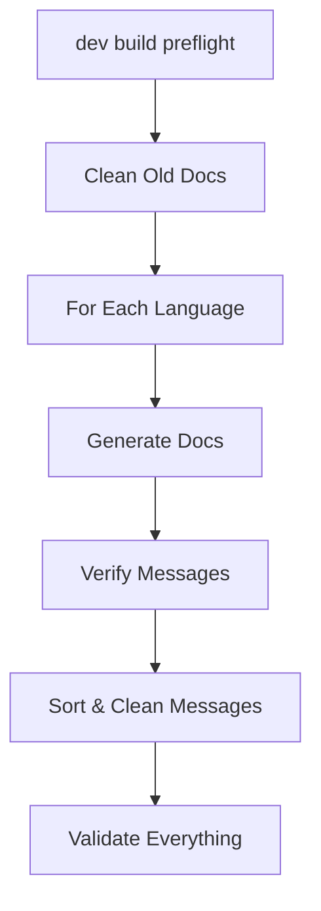

# Documentation Guide

## Overview

The watermint toolbox uses an automated documentation system that generates multiple types of documentation from source code and message resources. All user-facing text is internationalized through a comprehensive message system.

## Documentation Generation

### Main Commands

```bash
# Full documentation generation with validation
go run . dev build preflight

# Quick mode (English only)
go run . dev build preflight -quick

# Documentation only (no validation)
go run . dev build doc
```

### Dev Doc Commands

The `dev doc` command group provides specialized documentation tools:

#### Main Commands
- **`dev doc knowledge`** - Generate reduced knowledge base for LLMs
- **`dev doc markdown`** - Generate messages from markdown source

#### Message Management (`dev doc msg`)
- **`dev doc msg add`** - Add new message keys
- **`dev doc msg delete`** - Remove message keys  
- **`dev doc msg list`** - List all messages
- **`dev doc msg update`** - Update message values
- **`dev doc msg verify`** - Verify message integrity
- **`dev doc msg translate`** - Helper to identify missing translations

##### Language Options
All message commands support the `-msg-lang` option to specify the target language:
- `-msg-lang en` - Add/update English messages (default)
- `-msg-lang ja` - Add/update Japanese messages

Example:
```bash
# Add English message
go run . dev doc msg add -key "command.desc" -message "Description"

# Add Japanese translation
go run . dev doc msg add -key "command.desc" -message "説明" -msg-lang ja
```

#### Documentation Review (`dev doc review`)
- **`dev doc review approve`** - Approve documentation
- **`dev doc review list`** - List pending reviews
- **`dev doc review batch`** - Batch review operations

## Message Resources

### File Structure
```
resources/messages/
├── en/
│   └── messages.json    # English messages
└── ja/
    └── messages.json    # Japanese messages
```

### Message Key Conventions

#### General Pattern
```
<component>.<subcomponent>.<type>
```

#### Recipe (Command) Messages
```
<package>.<command>.<message_type>

Examples:
dropbox.file.copy.desc              # Command description
dropbox.file.copy.readme            # Detailed readme
dropbox.file.copy.arg.from          # Argument name
dropbox.file.copy.arg.from.desc     # Argument description
```

#### Common Message Types
- `.desc` - Brief description (command list)
- `.readme` - Detailed description (documentation)
- `.arg.<name>` - Argument display name
- `.arg.<name>.desc` - Argument description
- `.progress_*` - Progress messages
- `.error_*` - Error messages
- `.success_*` - Success messages

### Using Messages in Recipes

Define messages as struct fields with `app_msg.Message` type:

```go
type MyCommand struct {
    rc_recipe.RemarkSecret
    
    // Message variables - automatically mapped to keys
    ProgressScan    app_msg.Message  // => mypackage.mycommand.progress_scan
    ErrorNotFound   app_msg.Message  // => mypackage.mycommand.error_not_found
    SuccessComplete app_msg.Message  // => mypackage.mycommand.success_complete
}

func (z *MyCommand) Exec(c app_control.Control) error {
    ui := c.UI()
    
    // Use message variables directly
    ui.Progress(z.ProgressScan.With("Path", "/some/path"))
    ui.Error(z.ErrorNotFound.With("File", "test.txt"))
    ui.Success(z.SuccessComplete.With("Count", 10))
    
    return nil
}
```

### Template Variables

Messages support Go template syntax:
```json
{
  "file.process.progress": "Processing {{.filename}} ({{.percent}}% complete)",
  "file.copy.success": "Copied {{.count}} files in {{.duration}}"
}
```

Usage:
```go
msg := z.ProgressMessage.With("filename", "data.csv").With("percent", 75)
```

## Documentation Types

### Command Documentation
- **Location**: `docs/commands/` and `docs/ja/commands/`
- **Format**: Jekyll-compatible markdown with front matter
- **Content**: Description, usage, options, examples

### README Files  
- **Files**: `README.md`, `README_ja.md`
- **Generated from**: Templates and message resources
- **Content**: Overview, installation, command list

### Knowledge Base
- **Purpose**: LLM training data
- **Location**: `docs/knowledge/knowledge.md`
- **Content**: Consolidated, optimized documentation

### Web Documentation
- **Location**: `docs/` directory
- **Format**: Jekyll site
- **Includes**: Home, guides, command reference

## Documentation Flow

### 1. Preflight Process


### 2. Generation Steps
1. **Cleanup** - Remove outdated documentation
2. **Generation** - Create all documentation types
3. **Validation** - Check message completeness
4. **Optimization** - Remove unused keys, sort files

### 3. Message Validation
The system validates:
- Recipe messages (desc, readme, args)
- Ingredient messages (reusable components)
- Feature messages (experimental features)
- Message object definitions
- Template syntax validity

## Adding Documentation

### For New Commands
1. Create recipe file
2. Add English message keys:
```bash
go run . dev doc msg add -key "myfeature.command.desc" -message "Brief description"
go run . dev doc msg add -key "myfeature.command.readme" -message "Detailed documentation"
go run . dev doc msg add -key "myfeature.command.arg.input" -message "Input file"
go run . dev doc msg add -key "myfeature.command.arg.input.desc" -message "Path to input file"
```
3. Add Japanese translations:
```bash
go run . dev doc msg add -key "myfeature.command.desc" -message "簡潔な説明" -msg-lang ja
go run . dev doc msg add -key "myfeature.command.readme" -message "詳細なドキュメント" -msg-lang ja
go run . dev doc msg add -key "myfeature.command.arg.input" -message "入力ファイル" -msg-lang ja
go run . dev doc msg add -key "myfeature.command.arg.input.desc" -message "入力ファイルのパス" -msg-lang ja
```
4. Run `dev build preflight`

### For New Features
1. Add feature messages:
```json
{
  "feature.myfeature.desc": "Feature description",
  "feature.myfeature.disclaimer": "Beta feature warning",
  "feature.myfeature.agreement": "Terms of use"
}
```
2. Implement feature flags
3. Document in guides

## Best Practices

### Message Content
- Keep messages concise and clear
- Use active voice
- Include necessary context
- Avoid technical jargon
- Be consistent across languages

### Message Keys
- Use lowercase with dots
- Follow hierarchical structure  
- Be descriptive but concise
- Group related messages

### Templates
- Use meaningful variable names
- Provide all required variables
- Test with various inputs
- Handle pluralization properly

### Documentation
- Write for the end user
- Include practical examples
- Explain why, not just how
- Keep formatting consistent

## Troubleshooting

### Missing Message Keys
```
Error: message key not found: mycommand.desc
```
**Solution**: Add key to both language files

### Template Errors
```
Error: template: executing "mycommand.progress" at <.count>
```
**Solution**: Ensure all variables are provided with `.With()`

### Unused Keys
Preflight automatically removes unused keys. To preserve:
- Ensure it's used in code
- Or add reference in tests

### Documentation Not Generated
Check:
- File permissions in docs/
- Not in test mode
- Disk space available
- JSON syntax valid

## Maintenance

### Regular Tasks
```bash
# Clean up messages and regenerate docs
go run . dev build preflight

# Verify message usage
go run . dev doc msg verify

# List all messages
go run . dev doc msg list
```

### Adding Languages
1. Create `resources/messages/<lang>/`
2. Copy and translate messages.json
3. Update language support in code
4. Test thoroughly

## Performance

### Optimization
- Quick mode for development
- Full mode before commits
- Parallel generation where possible
- In-memory message sorting

### Execution Time
- Quick mode: 10-30 seconds
- Full mode: 2-5 minutes
- Factors: command count, message size

## Integration

### CI/CD Pipeline
```yaml
- name: Documentation Check
  run: |
    go run . dev build preflight
    git diff --exit-code || exit 1
```

### Pre-commit Hook
```bash
#!/bin/sh
go run . dev build preflight -quick || exit 1
```

Remember: Always run `dev build preflight` before committing!