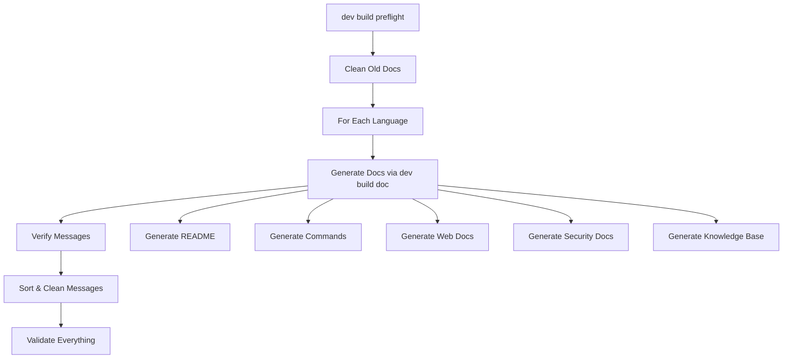

# Documentation Generation Flow

This document provides a detailed walkthrough of how the `dev build preflight` command generates the complete documentation set for the watermint toolbox project.

## High-Level Flow



## Detailed Step-by-Step Process

### 1. Initialization Phase

When you run `dev build preflight`:

```bash
go run tbx.go dev build preflight
```

The command initializes with:
- Target languages (English and Japanese, or just English with `-quick`)
- Logging configuration
- Feature detection (test mode vs production)

### 2. Documentation Cleanup

For each language, the system:
1. Removes all files from `docs/commands/`
2. Removes all files from `docs/guides/`
3. Ensures clean directories for regeneration

**Code Location**: `preflight.go:deleteOldGeneratedFiles()`

### 3. Documentation Generation

The preflight command calls `dev build doc` internally, which triggers:

#### 3.1 README Generation
- **Files Generated**: 
  - `README.md` (English)
  - `README_ja.md` (Japanese)
- **Template**: Uses message resources with keys like `doc.readme.*`
- **Content**: Project overview, installation, command list
- **Code**: `doc.go:genReadme()`

#### 3.2 Security Documentation
- **Files Generated**: 
  - `SECURITY_AND_PRIVACY.md`
  - `SECURITY_AND_PRIVACY_ja.md`
- **Content**: Security policies, privacy information
- **Code**: `doc.go:genSecurity()`

#### 3.3 Command Documentation
For each recipe (command) in the system:
- **Files Generated**: `docs/commands/<command-name>.md`
- **Process**:
  1. Iterate through all recipes in the catalogue
  2. Extract command metadata (description, arguments, examples)
  3. Generate markdown with Jekyll front matter
  4. Handle compatibility documentation for renamed commands
- **Code**: `doc.go:genCommands()`

#### 3.4 Web Documentation
- **Files Generated**: Various pages in `docs/`
- **Includes**:
  - Home page (`home.md`)
  - Guide pages
  - Navigation structure
- **Code**: `doc.go:genWeb()`

#### 3.5 Supplemental Documentation
- **Purpose**: Additional guides and documentation
- **Content**: Troubleshooting, advanced usage, etc.
- **Code**: `doc.go:genSupplemental()`

#### 3.6 Contributor Documentation
- **Purpose**: Documentation for contributors
- **Content**: Development guides, architecture
- **Code**: `doc.go:genContributor()`

#### 3.7 Knowledge Base
- **Purpose**: Consolidated documentation for LLM training
- **Location**: `docs/knowledge/knowledge.md`
- **Content**: All commands, features, and guides in one file
- **Code**: `doc.go:genKnowledge()`

### 4. Message Verification

After documentation generation, the system verifies:

#### 4.1 Recipe Messages
- Validates each recipe has required message keys
- Checks for:
  - Description (`.desc`)
  - README content (`.readme`)
  - Argument descriptions (`.arg.*`)

#### 4.2 Ingredient Messages
- Validates reusable components have proper messages
- Ensures all user-facing text is defined

#### 4.3 Feature Messages
- Validates experimental features have:
  - Feature description
  - Disclaimer text
  - Agreement text

#### 4.4 Message Object Messages
- Validates structured message objects
- Ensures all fields have corresponding messages

**Code Location**: `preflight.go:Exec()` lines 163-201

### 5. Message Resource Optimization

The final phase cleans and organizes message files:

#### 5.1 Identify Unused Keys
- Compares defined keys with touched keys
- Identifies keys not used anywhere in code

#### 5.2 Remove Unused Keys
- Automatically deletes unused keys
- Logs each removal for tracking

#### 5.3 Sort Messages
- Sorts all remaining keys alphabetically
- Ensures consistent file format
- Pretty-prints JSON with proper indentation

**Code Location**: `preflight.go:sortMessages()`

## File Generation Details

### Documentation File Structure
```
docs/
├── index.html              # Jekyll site index
├── home.md                # Home page content
├── commands/              # Command documentation
│   ├── toc.md            # Table of contents
│   ├── dropbox-file-copy.md
│   └── ...
├── guides/                # User guides
├── ja/                    # Japanese documentation
│   ├── home.md
│   └── commands/
└── knowledge/             # LLM training data
    └── knowledge.md
```

### Jekyll Front Matter
Each generated markdown file includes Jekyll front matter:
```yaml
---
layout: command
title: Command Title
lang: en
---
```

### Message Resource Updates
The system modifies:
- `resources/messages/en/messages.json`
- `resources/messages/ja/messages.json`

## Error Handling

### Common Issues and Solutions

1. **Missing Message Keys**
   - **Error**: "Message key not found: x.y.z"
   - **Cause**: Code references a key not in message files
   - **Solution**: Add the key to message resources

2. **Documentation Generation Fails**
   - **Error**: "Failed to generate documents"
   - **Cause**: File permissions or disk space
   - **Solution**: Check permissions and available space

3. **Message File Corruption**
   - **Error**: "Unable to unmarshal message file"
   - **Cause**: Invalid JSON syntax
   - **Solution**: Fix JSON syntax errors

4. **Unused Key Removal Issues**
   - **Warning**: Important keys being removed
   - **Cause**: Keys only used dynamically
   - **Solution**: Add explicit references in code

## Performance Considerations

### Execution Time
- Quick mode: 10-30 seconds (English only)
- Full mode: 2-5 minutes (all languages)
- Factors affecting time:
  - Number of commands
  - Message file size
  - Disk I/O speed

### Memory Usage
- Loads all messages into memory
- Processes recipes sequentially
- Peak usage during message sorting

### Optimization Tips
1. Use `-quick` during development
2. Run full preflight before commits
3. Keep message files organized
4. Remove truly unused features

## Integration Points

### Continuous Integration
```yaml
- name: Documentation Check
  run: |
    go run tbx.go dev build preflight
    git diff --exit-code || (echo "Documentation out of sync" && exit 1)
```

### Pre-commit Hook
```bash
#!/bin/sh
go run tbx.go dev build preflight -quick || exit 1
```

### Release Process
1. Update version and release notes
2. Run `dev build preflight` (full)
3. Commit all changes
4. Tag release

## Debugging Documentation Generation

### Enable Debug Logging
```bash
tbx -debug dev build preflight
```

### Trace Message Usage
Look for logs like:
```
DEBUG message key=dropbox.file.copy.desc text="Copy files or folders"
```

### Verify Generated Files
```bash
# List recently modified docs
find docs -name "*.md" -mtime -1

# Check message file changes
git diff resources/messages/
```

## Best Practices

1. **Regular Runs**: Run preflight frequently during development
2. **Review Changes**: Always review removed message keys
3. **Test Documentation**: Verify generated docs render correctly
4. **Maintain Translations**: Keep all languages in sync
5. **Document Features**: Add messages for all new features
6. **Clean Commits**: Include doc updates with feature commits

## Summary

The `dev build preflight` command orchestrates a complex documentation generation process that ensures:
- All documentation is up-to-date
- Message resources are clean and organized  
- User-facing text is properly internationalized
- The project maintains high documentation standards

This automated approach reduces manual work and ensures consistency across the entire project.